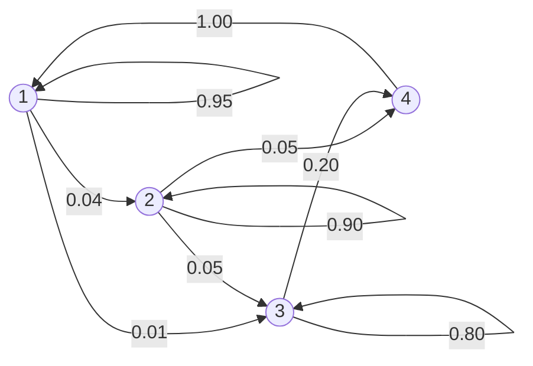

# Markov Graphs Project

Implémentation minimale en C pour créer et manipuler des chaînes de Markov finies (graphe d’états + probabilités de transition) et faire quelques simulations.

## Fonctionnalités
- Chargement d’un graphe depuis un fichier texte (états + transitions).
- Affichage du graphe (console).
- Vérification de si c'est un graphe de Markov valide (somme des probabilités = 1 pour chaque état).
- Regroupement des états en classes à l'aide de l'algorithme de Tarjan.
- Génération d'un diagramme de Hasse exportable en Mermaid.
- Affiche des caractéristiques basiques du graphe.
- Calcul de la distribution après n pas (itérations successives).
- Export rapide du graphe en diagramme Mermaid.

## Compilation
```bash
git clone https://github.com/GardeDeNuit/markov-graphs-project.git
cd markov-graphs-project
cmake -S . -B build
cmake --build build
```

Exécutable (exemple) :
```bash
./markov_cli --graph data/exemple.txt --simulate 20 --initial S0
```

## Format d’entrée (exemple)
```
4
1 1 0.95
1 2 0.04
1 3 0.01
2 2 0.9
2 3 0.05
2 4 0.05
3 3 0.8
3 4 0.2
4 1 1
```
Chaque ligne: source destination probabilité.

## Exemple Mermaid


## Auteur
LEMONNIER Louis
LEROY Mathias
SPINDLER Mattéo
